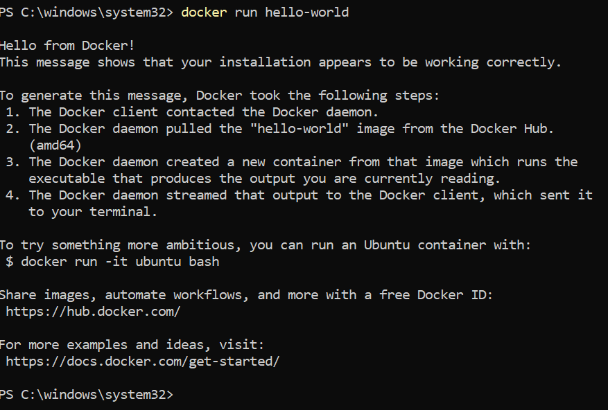

# Anleitung zur Installation des Projekts

### **1. GitHub-Fork erstellen und Klonen des Repositories**

- **Repository forken**
Erstelle auf GitHub einen Fork des Projekts docker-nodejs-sample.

- **Projekt klonen in Git Bash**
git clone https://github.com/[dein-github-username]/docker-nodejs-sample.git

- **In das Projektverzeichnis wechseln**
cd docker-nodejs-sample

- **Git-Status prüfen**
git status

### **2. Docker-Konfiguration und -Installation**

- **Docker Desktop installieren**
Lade Docker Desktop herunter und installiere es.
- **Docker-Erweiterung für VS Code**
Installiere in Visual Studio Code die Docker Extension
- **WSL 2 aktivieren**
Öffne PowerShell als Administrator und führe folgende Befehle aus:
dism.exe /online /enable-feature /featurename:Microsoft-Windows-Subsystem-Linux /all /norestart
dism.exe /online /enable-feature /featurename:VirtualMachinePlatform /all /norestart
Danach den PC neu starten und WSL 2 als Standardversion festlegen:
wsl --set-default-version 2
- **Linux-Distribution**
Anschliessend im Microsoft Store eine Linux-Distribution installieren.
- **Installation testen**
docker run hello-world

