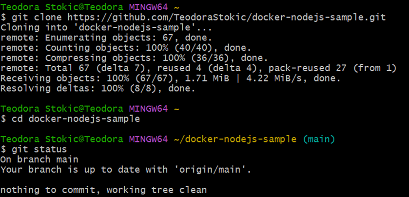

# Anleitung zur Installation des Projekts

### **1. GitHub-Fork erstellen und Klonen des Repositories**

- **Repository forken**
Erstelle auf GitHub einen Fork des Projekts docker-nodejs-sample.

- **Projekt klonen in Git Bash**
git clone https://github.com/[dein-github-username]/docker-nodejs-sample.git

- **In das Projektverzeichnis wechseln**
cd docker-nodejs-sample

- **Git-Status prüfen**
git status

