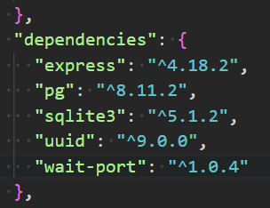
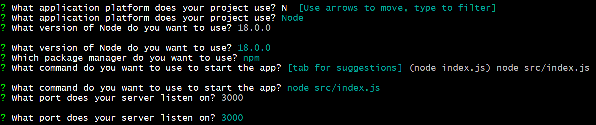

# Anleitung zur Installation des Projekts

## **1. GitHub-Fork erstellen und Klonen des Repositories**

- **Repository forken**
Erstelle auf GitHub einen Fork des Projekts docker-nodejs-sample.

- **Projekt klonen in Git Bash**
`git clone https://github.com/[dein-github-username]/docker-nodejs-sample.git`

- **In das Projektverzeichnis wechseln**
cd docker-nodejs-sample

- **Git-Status prüfen**
git status

### **2. Installation der notwendigen Pakete**

- **Installation**
Um alle Pakete zu installieren, wird im Projektordner der folgende Befehl in der Konsole ausgeführt: *npm install*

### **3. Docker-Konfiguration und -Installation**

- **Docker Desktop installieren**
Lade Docker Desktop herunter und installiere es.
- **Docker-Erweiterung für VS Code**
Installiere in Visual Studio Code die Docker Extension
- **WSL 2 aktivieren**
Öffne PowerShell als Administrator und führe folgende Befehle aus:
dism.exe /online /enable-feature /featurename:Microsoft-Windows-Subsystem-Linux /all /norestart
dism.exe /online /enable-feature /featurename:VirtualMachinePlatform /all /norestart
Danach den PC neu starten und WSL 2 als Standardversion festlegen:
wsl --set-default-version 2
- **Linux-Distribution**
Anschliessend im Microsoft Store eine Linux-Distribution installieren.
- **Installation testen**
docker run hello-world

### **4. Projekt starten mit Docker**

- **Projekt initialisieren**
Im Projektverzeichnis docker-nodejs-sample
*docker init* schreiben. Folge den Fragen im Terminal und beantworte sie wie folgt:
   
- **Starten der Applikation**
Nun führe im Terminal den folgenden Befehl aus:
*docker compose up –build*
Öffne anschliessend einen Webbrowser und gehe zu [Local Host](http://localhost:3000.)

>![WARNING] Wenn es nicht klappt, kann es an der alten Version 18.0.0 liegen. Öffne in Visual Studio Code die Dockerfile und ändere die Version auf 22.18.0.
